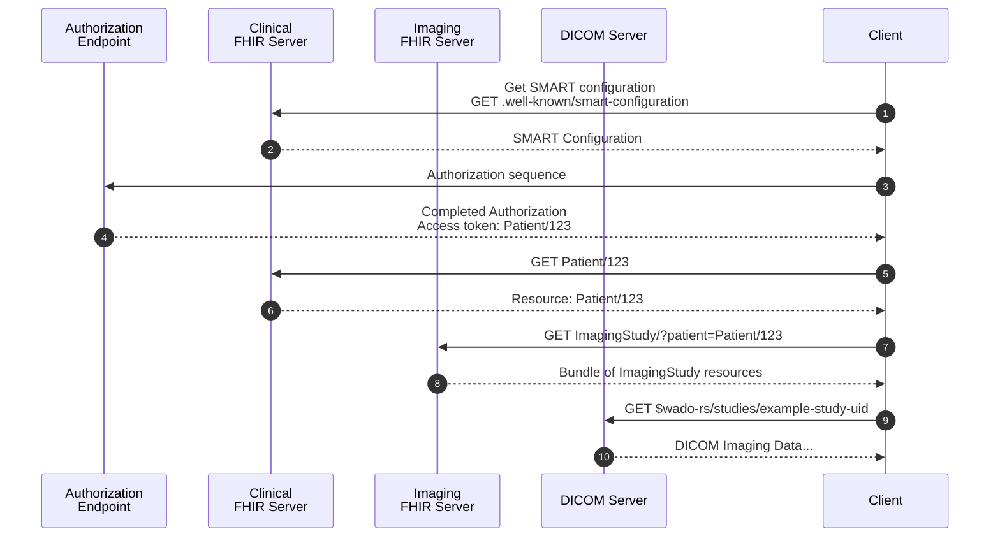

# Workflow

```mermaid
sequenceDiagram
  autonumber
  participant A as Authorization<br/>Endpoint
  participant CFS as Clinical<br/>FHIR Server
  participant IFS as Imaging<br/>FHIR Server
  participant D as DICOM Server
  participant C as Client
  C->>CFS: Get SMART configuration<br/>GET .well-known/smart-configuration
  CFS-->>C: SMART Configuration
  C->>A: Authorization sequence
  A-->>C: Completed Authorization<br/>Access token: Patient/123
  C->>CFS: GET Patient/123
  CFS-->>C: Resource: Patient/123
  C->>IFS: GET ImagingStudy/?patient=Patient/123
  IFS-->>C: Bundle of ImagingStudy resources
  C->>D: GET $wado-rs/studies/example-study-uid
  D-->>C: DICOM Imaging Data...
```
