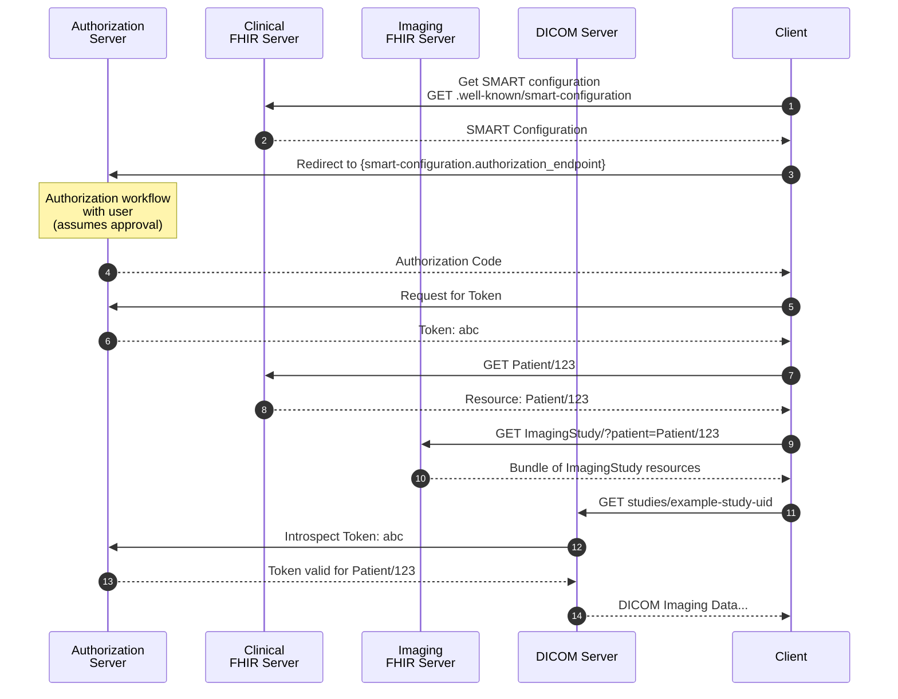

# Workflow

```mermaid
sequenceDiagram
  autonumber
  participant AS as Authorization<br/>Server
  participant CFS as Clinical<br/>FHIR Server
  participant IFS as Imaging<br/>FHIR Server
  participant D as DICOM Server
  participant C as Client
  C->>CFS: Get SMART configuration<br/>GET .well-known/smart-configuration
  CFS-->>C: SMART Configuration
  C->>AS: Redirect to {smart-configuration.authorization_endpoint}
  Note over AS: Authorization workflow<br/>with user<br/>(assumes approval)
  AS-->>C: Authorization Code
  C->>AS: Request for Token
  AS-->>C: Token: abc
  C->>CFS: GET Patient/123
  CFS-->>C: Resource: Patient/123
  C->>IFS: GET ImagingStudy/?patient=Patient/123
  IFS-->>C: Bundle of ImagingStudy resources
  C->>D: GET studies/example-study-uid
  D->>AS: Introspect Token: abc
  AS-->>D: Token valid for Patient/123
  D-->>C: DICOM Imaging Data...
```
