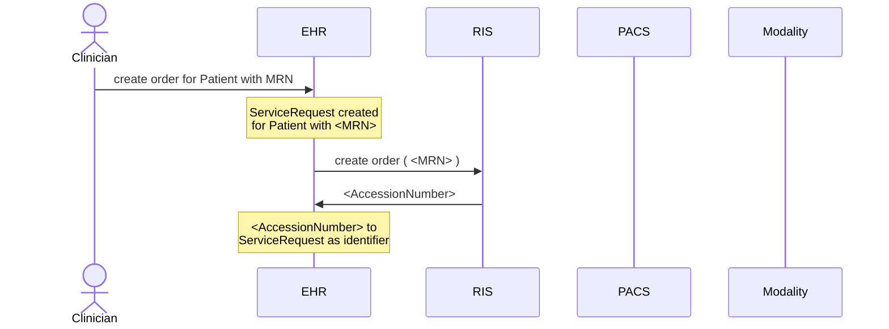
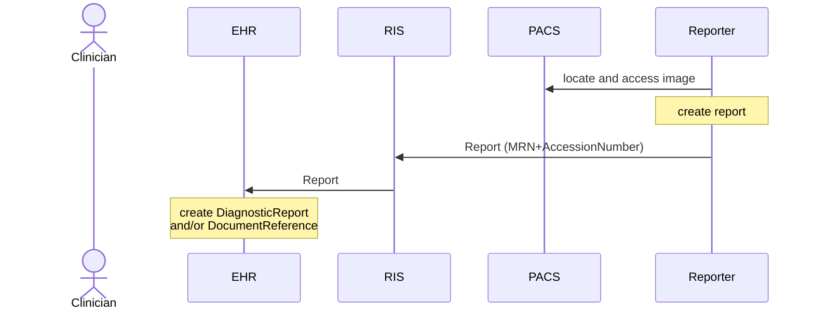
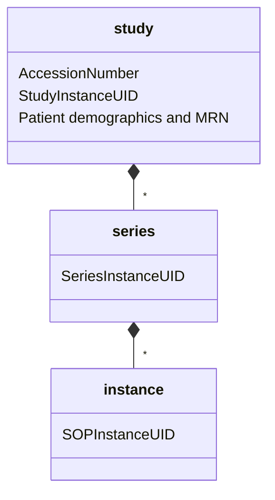
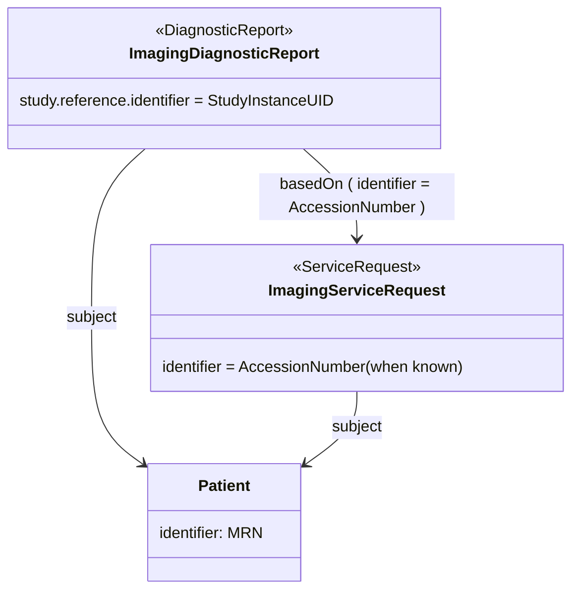

# Identifiers use in FHIR imaging

This section introduces the different viewpoint on the data and the identifiers that are native to each domain.

We will first introduce the most relevant identifiers. Indicate when these identifiers are created in a (simplified) radiology workflow and provide three domain models that indicate where these identifiers are placed in DICOM, in the FHIR Imaging System and in the EHR.

## Main identifiers in this context

The main identifiers used are:

* `MRN`: the Medical Record Number of the Patient.
* `AccessionNumber`: the RIS defined identifier for the imaging order.
* `StudyInstanceUID`: The DICOM identifier of an ImagingStudy.
* `SeriesInstanceUID`: The DICOM identifier of a series within an ImagingStudy.
* `SOPInstanceUID`: The DICOM identifier of a study within serie.

## Imaging workflow in a hospital

The contents of this section has been inspired by the IHE RAD profiles (https://profiles.ihe.net/RAD/). Based on these IHE-RAD profiles, the following (abstracted) view on the imaging related dynamics in a hospital can be derived.

Note that we removed aspects as DICOM worklist and the finer details in the workflow as they are less relevant for this discussion.

### Create an image order

As can be seen in the diagram, the RIS is responsible for the creation of the `AccessionNumber`.

### Acquire the image

Once the image is acquired, it is stored in the PACS. The PACS is responsible for creating the DICOM related identifiers (see DICOM model).

### Create the report

The Reporter generates the report and sends it to the RIS. The `AccessionNumber` and `MRN` identify the report.

## Models for this IG

There are different views in the data relevant for this activity. This section introduces those models and where the different identifiers are placed.

### DICOM model

The figure below indicates the DICOM model.

### FHIR imaging resource model

The base FHIR model to be presented in FHIR Imaging System is presented below.

This model is a FHIR reflection of the data available in DICOM as can be retrieved through DICOM web. The figure only shows the main elements.

The ImagingStudy resource represents the DICOM study. I holds the ids for the series and instances. These id's can be used to retrieve imaging data though WADO.

It refers to a Patient resource to hold the Patient information stored in the DICOM study and to a ServiceRequest resource to hold the order related data (`AccessionNumber`).

The ImagingStudy resource also refers to one or more EndPoint resources that hold the WADO url the application can use to retrieve the DICOM information. Note that for different studies, different endpoints can be used.

### EHR model

The model rom the EHR perspective is presented below. This model is based on the model defined in US core.

Note this is my interpretation on how this could work.

In order to achieve loose coupling between the EHR model and the FHIR Imaging System, no full URL references are assumed. When the URL is known, they should be included. When not known, an identifier reference is used.

The ServiceRequest holds the `AccessionNumber` as a identifier. When first created this is not available and is added as soon as the RIS provides it.

The DiagnosticReport refers to the ImagingStudy using the `study` field, the suggestion is to add a identifier using the `StudyInstanceUID` reference to the ImagingStudy.

Both the DiagnosticReport and ServiceRequest refer to the Patient. The Patient holds its `MRN` as an identifier.

## Evaluation

The FHIR models presented allow the application to retrieve the relevant information from the EHR that allows it to search and retrieve the DICOM related information in the FHIR Imaging System. 

The approach retains a loose coupling between the EHR and Imaging FHIR servers, allowing them to be deployed independenlt from each other based on a minimal set of identifiers.

