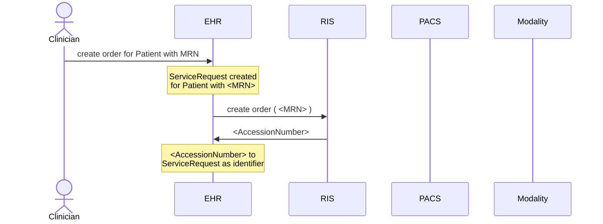
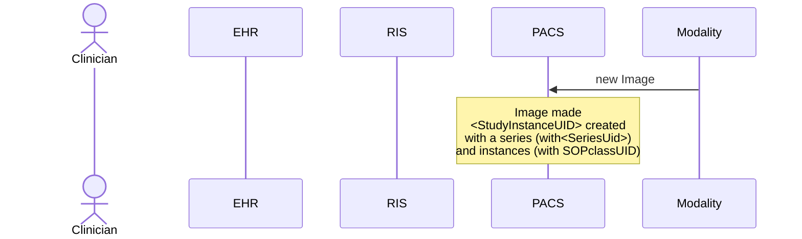
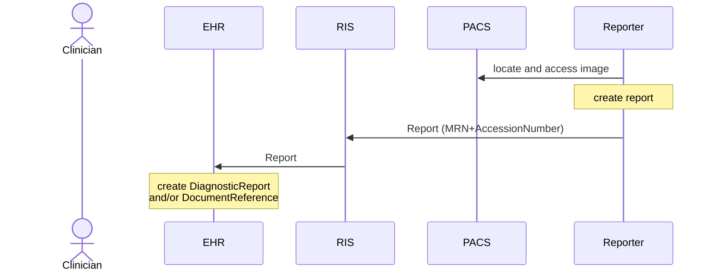
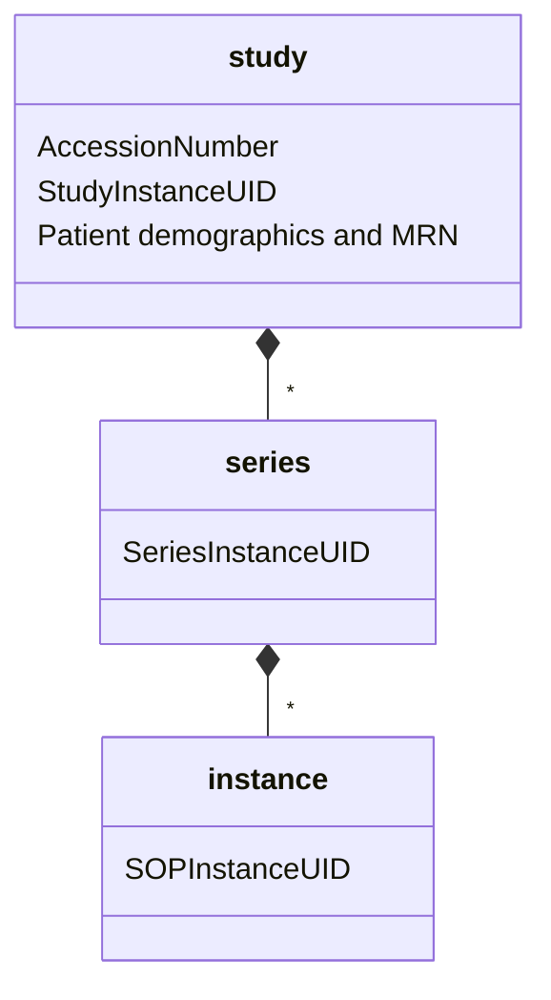
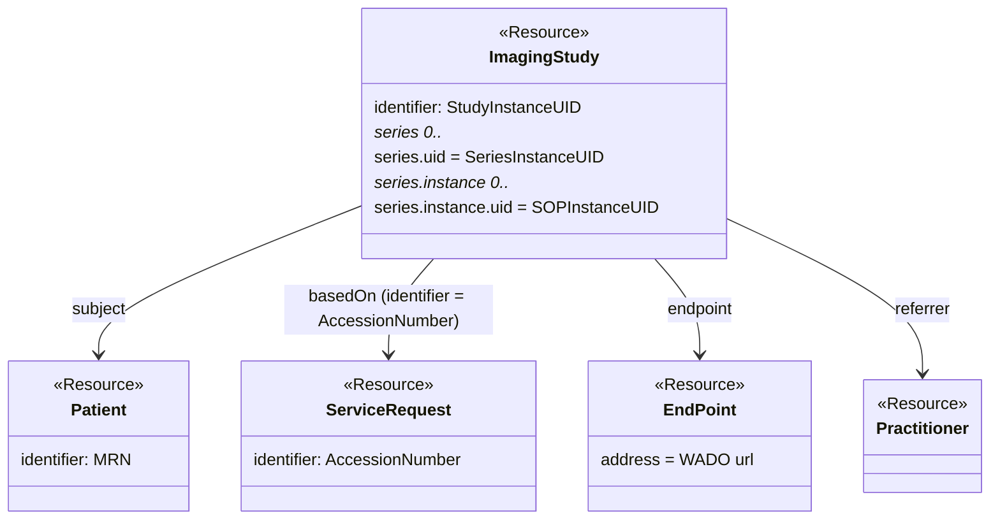
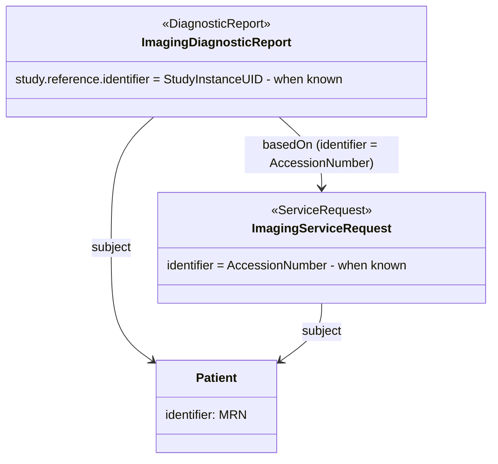

# Identifiers used in FHIR Imaging

This section offers a primer on imaging infrastructure, including a brief description of the role of EHR, RIS, and PACS, focusing on the data and identifiers that are native to each domain. This content is non-normative.

We will first introduce the most relevant identifiers, indicate when these identifiers are created in a (simplified) radiology workflow, and provide three domain models that indicate where these identifiers are placed in DICOM, in the FHIR Imaging System, and in the EHR.

## Main Identifiers in the imaging context

The main identifiers used are:

- `MRN`: The Medical Record Number of the Patient.
- `AccessionNumber`: The RIS-defined identifier for the imaging order.
- `StudyInstanceUID`: The DICOM identifier of an ImagingStudy.
- `SeriesInstanceUID`: The DICOM identifier of a series within an ImagingStudy.
- `SOPInstanceUID`: The DICOM identifier of a study within a series.

## Imaging workflow in a hospital

The contents of this section have been inspired by the IHE RAD profiles (https://profiles.ihe.net/RAD/). Based on these IHE-RAD profiles, the following (abstracted) view on the imaging-related dynamics in a hospital can be derived.

Note that we removed aspects such as DICOM worklist and the finer details in the workflow, as they are less relevant for this discussion.

### Create an image order

As seen in the diagram, the RIS is responsible for creating the `AccessionNumber`.

### Acquire the image

Once the image is acquired, it is stored in the PACS. The PACS is responsible for creating the DICOM-related identifiers (see DICOM model).

### Create the report

The Reporter generates the report and sends it to the RIS. The `AccessionNumber` and `MRN` identify the report.

## Models

There are different views on the data relevant for this activity. This section introduces those models and where the different identifiers are placed.

### DICOM model

The figure below indicates the DICOM model.

### FHIR Imaging model

The base FHIR model to be presented in FHIR Imaging System is presented below.

This model is a FHIR reflection of the data available in DICOM, as can be retrieved through DICOM web. The figure only shows the main elements.

The ImagingStudy resource represents the DICOM study. It holds the IDs for the series and instances. These IDs can be used to retrieve imaging data through WADO.

It refers to a Patient resource to hold the Patient information stored in the DICOM study and to a ServiceRequest resource to hold the order-related data (`AccessionNumber`).

The ImagingStudy resource also refers to one or more EndPoint resources that hold the WADO URL the application can use to retrieve the DICOM information. Note that for different studies, different endpoints can be used.

### EHR model

One possible model from the EHR perspective is presented below, consistent with on early designs from US Core.  Note this is just one interpretation of how an EHR might represent imaging reports. It is expected that as consensus is reached, jurisdictional implementation guides such as [FHIR US Core](https://www.hl7.org/fhir/us/core/) will provide more specific guidance.

In order to achieve loose coupling between the EHR model and the FHIR Imaging System, the EHR is not assumed to have full URL references to imaging content. When full URLs are known, they should be included. When not known, an identifier reference is used. In this model:

* The ServiceRequest holds the `AccessionNumber` as an identifier. When first created, this is not available and is added as soon as the RIS provides it.

* The DiagnosticReport refers to the ImagingStudy using the `study` field; the suggestion is to add an identifier using the `StudyInstanceUID` reference to the ImagingStudy.

* Both the DiagnosticReport and ServiceRequest refer to the Patient. The Patient holds its `MRN` as an identifier.

## Notes

The FHIR models presented allow the application to retrieve the relevant information from the EHR, enabling it to search and retrieve the DICOM-related information in the FHIR Imaging System.

The approach retains a loose coupling between the EHR and Imaging FHIR servers, allowing them to be deployed independently from each other based on a minimal set of identifiers.
  
